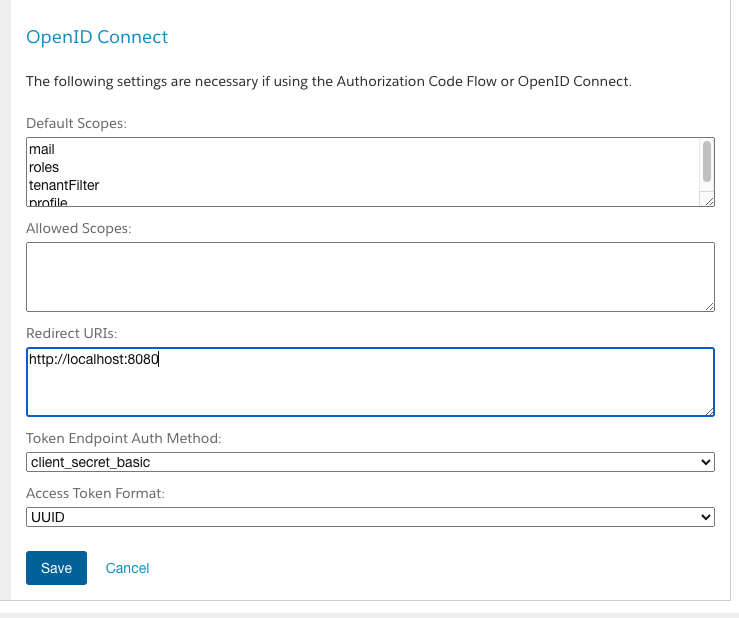

# b2c-tools

[](https://github.com/SalesforceCommerceCloud/b2c-tools/actions/workflows/test.yaml)

`b2c-tools` is a CLI tool and library for data migrations, import/export, scripting and other tasks with SFCC B2C
instances and administrative APIs (SCAPI, ODS, etc). It is intended to be complimentary to other tools such as `sfcc-ci`
for development and CI/CD scenarios.

## Features

- A CLI and [extendable](./docs/EXTENDING.md) library that understands most common B2C configuration sources
  including [multiple instances](#configuration)
- A data migration system for managing imports and migration "scripts" to B2C instances
    - see [Migrations](#migrations) for usage and [docs/MIGRATIONS](docs/MIGRATIONS.md) for details
- A [feature management system](#feature-management) ([more details](./docs/FEATURES.md))
- [Importing](#import-run) impex archives (without uploading or zipping contents) and
  running [migration scripts](./docs/MIGRATIONS.md#migration-scripts)
- Interactive [site export](#site-export) without logging into business manager
- Page Designer [page export](#page-export) with sub-components and static asset download
- [Extendable CLI](./docs/EXTENDING.md) and [API](./docs/API.md) for building new command line interfaces and tools
- [Instance management](#instance-management)
- [Log Tail](#log-tailing) for watching instance logs
  - With [tasks.json](./docs/TASKS.md) support for VSCode and other editors
- Other miscellaneous tools for syncing/mirroring cartridges

## Installation


### Binaries / Single File

Single file installs are available for download from the [releases](https://github.com/SalesforceCommerceCloud/b2c-tools/releases) starting with version 0.22.0. Windows and MacOS binaries
are unsigned and must be explicitly trusted.

#### NodeJS

A single file javascript is available that will execute using your local NodeJS installation. This is the easiest way
to get started if you already have node installed.

Download the `b2c-tools.js` file and move to your project or a location in your path:

```shell
chmod a+x b2c-tools.js
mv b2c-tools.js /usr/local/bin/b2c-tools
```

(on Windows keep the `.js` extension)

#### Linux

Download the `b2c-tools-linux-x64` binary

```shell
chmod a+x b2c-tools-linux-x64
mv b2c-tools-linux-x64 /usr/local/bin/b2c-tools
```

#### MacOS

Download the `b2c-tools-macos` binary

```shell
chmod a+x b2c-tools-macos
# remove quarantine flag to trust the file
xattr -dr com.apple.quarantine b2c-tools-macos
mv b2c-tools-macos /usr/local/bin/b2c-tools
```

#### Windows

Note: at this time the Windows binaries work but may be flagged by Windows Defender. Recommend
using another install option such as the [NodeJS](#nodejs) method.

Download the `b2c-tools-window.exe` binary

### Install From Repository

The easiest way to install is directly via a git checkout/export:

```shell
git clone -b latest --single-branch git@github.com:SalesforceCommerceCloud/b2c-tools
cd b2c-tools

# install out of this clone
npm install
npm install -g .

# or as a package
npm pack
npm install -g ./*.tgz
```

### Install Into Your Project

It is recommended to install b2c-tools as a dependency of your project. This way users will not need to install it explicitly. You also
get support for types and debugging of the tool without transpiling.

Clone the repo into your project and install as an npm `file://` dependency:

```shell
git subtree add --prefix dependencies/b2c-tools git@github.com:SalesforceCommerceCloud/b2c-tools latest --squash 
npm install ./dependencies/b2c-tools --save-dev
```

At this point, you can run b2c-tools using the following command within your project

```shell
npx b2c-tools --help
```

See also [Extendable CLI](./docs/EXTENDING.md) to create a project specific CLI instead of using npm run scripts above.

### NPM Package

**Note: Private packages can be clunky to deal with so this method is only recommended if you require an npm
repository**

Since `b2c-tools` is a private package on github's registry you must configure a scoped registry in your project or
user `.npmrc` file and login with a
github [personal access token](https://docs.github.com/en/authentication/keeping-your-account-and-data-secure/creating-a-personal-access-token)
. For example:

```
// ~/.npmrc
//npm.pkg.github.com/:_authToken=ghp_ABC1234
@SalesforceCommerceCloud:registry=https://npm.pkg.github.com
```

See [Creating a Personal Access Token](https://docs.github.com/en/authentication/keeping-your-account-and-data-secure/creating-a-personal-access-token)
.
The access token will require `read:packages` permissions.

* (You can also
  see [Authenticating with a personal access token](https://docs.github.com/en/packages/working-with-a-github-packages-registry/working-with-the-npm-registry#authenticating-with-a-personal-access-token)
  and [Installing a Package](https://docs.github.com/en/packages/working-with-a-github-packages-registry/working-with-the-npm-registry#installing-a-package)
  from the github docs for more info.)

You can then install the scoped package globally (or as a project dependency):

```shell
npm install -g @SalesforceCommerceCloud/b2c-tools
b2c-tools --help
```

## Usage

See `b2c-tools --help` for CLI parameters:

```
b2c-tools <command>

Commands:
  b2c-tools export    exports data from b2c instances
  b2c-tools import    manage data imports and migrations
  b2c-tools instance  project/environment management commands
  b2c-tools code      manage code versions
  b2c-tools tail      watch instance logs
  b2c-tools feature   feature management

B2C Connection:
  -i, --instance                            instance name in config file
  -s, --server                              b2c instance hostname
  -u, --username                            webdav username
  -p, --password                            password/webdav access key  [string]
      --client-id, --oauth-client-id        API client ID               [string]
      --client-secret,                      API client secret
      --oauth-client-secret                                             [string]
      --code-version                        b2c code version            [string]
      --verify                              verify SSL [boolean] [default: true]
      --secure-server                       b2c instance hostname (webdav write
                                            access)
      --certificate                         path to pkcs12 certificate for 2FA
      --passphrase                          passphrase for certificate option
      --cartridge, --include-cartridges     cartridges (Default: autodetect)
                                                                         [array]
      --exclude-cartridges                  ignore these cartridges      [array]
      --short-code                          SCAPI short code

Managed Runtime
      --mrt-api-key,                        MRT API Key
      --managed-runtime-api-key                                         [string]
      --mrt-credentials-file                MRT Credentials file
                                                 [string] [default: "~/.mobify"]

IntellijSFCC Plugin
      --use-intellij-connections   use intellij sfcc plugin connections from
                                   project            [boolean] [default: false]
      --intellij-project-file      path to intellij sfcc connections setting
                                   source file     [default: "./.idea/misc.xml"]
      --intellij-credentials-file  path to intellij sfcc plugin encrypted
                                   credentials file
      --intellij-credentials-key   key for intellij sfcc plugin encrypted
                                   credentials file

Options:
      --version       Show version number                              [boolean]
  -D, --debug         output debug logging (also to debug.log)
                                                      [boolean] [default: false]
      --log-level     log at a specific level
  [string] [choices: "none", "debug", "info", "warn", "error"] [default: "info"]
      --oauth-scopes  OAuth scope list                                   [array]
      --config        path to dw.json config                [default: "dw.json"]
      --vars          arbitrary variables for scripts (see extra-vars)
      --vars-json     arbitrary variables for scripts; merged with vars; json
                      string
      --vars-file     load arbitrary variables from json files (merged with
                      vars)
      --help          Show help                                        [boolean]

For more information, read our manual at
https://github.com/SalesforceCommerceCloud/b2c-tools
```

### Import

#### Migrations

B2C Data Migrations are a mechanism for sharing, versioning and applying changes to B2C instances
in an idempotent fashion. Migrations can be folders in B2C Site Import/Export (impex) form or custom
scripts.

See [docs/MIGRATIONS](docs/MIGRATIONS.md) for in-depth discussion of data migrations and configuration.


```shell
b2c-tools import migrate --help

# print available migrations for the current instance
b2c-tools import migrate --dry-run

# apply available migrations
b2c-tools import migrate

# run available migrations but do not apply (non-idempotent)
b2c-tools import migrate --no-apply

# NOTE: these configuration options are best placed in the package.json of your project
# see configuration

# apply migrations from a non-default directory
b2c-tools import migrate --migrations-dir=imports

# exclude migrations by regular expression pattern
b2c-tools import migrate -x '^EXAMPLE'
```

#### Import Run

Any valid impex folder, zip or migration script (see [docs/MIGRATIONS](docs/MIGRATIONS.md)) can be executed using
the `import run`
subcommand.

```shell
# run an extract site impex
b2c-tools import run path/to/impex-folder

# run a site impex archive
b2c-tools import run path/to/import.zip

# run a migration script
b2c-tools import run path/to/script.js

# run a migration script initializing vars
b2c-tools --vars '{"test":"foo"}' import run path/to/script.js
# or
SFCC_VARS__test=foo b2c-tools import run path/to/script.js
# or
SFCC_VARS__test2__bar=baz b2c-tools import run path/to/script.js --vars-json '{"test":"foo"}'

# run a migration script with a HEREDOC (count total sites from OCAPI)
TOTAL_SITES=$(
b2c-tools --log-level none import run - <<EOF | jq .total
  console.log(JSON.stringify((await env.ocapi.get('sites')).data));
EOF
)
echo "Total sites: $TOTAL_SITES"
```

### Export

#### Site Export

The `export site` subcommand will open a browser to interactively select data units to export
in site import/export (impex) form. The resulting export will be placed in extracted form in the given
output folder (default `./tmp`).


This tool allows for quickly exporting data as well as creating data migrations without the need
to log into business manager.

```shell
b2c-tools export site
# use browser to select data units

# export to the migrations folder
b2c-tools export site -o migrations
```

#### Page Export

`export page <pageids..>` will export the shared or site library, extract page designer pages by ID, extract
components of those pages and finally download static assets such as images from the library into an extracted impex
folder in the output location (default './tmp'):



```shell
# export the homepage PD page
b2c-tools export page homepage

# export two pages and their components/assets
b2c-tools export page homepage contactus

# export to a different directory
b2c-tools export page -o migrations homepage

# specify the library ID
b2c-tools export page --library RefArchSharedLibrary homepage

# use a non-shared library
b2c-tools export page --library MySite --is-site-library homepage

# search for images using non-default json paths for component attributes
b2c-tools export page homepage --asset-query image.path mobileImage.path

# export from a local XML file instead of the instance (offline mode; no asset download)
b2c-tools export page homepage --library-file ./library.xml --offline

# export pages that match a regexp (here exporting all)
b2c-tools export page -r '.*'

# export content/pages from specific folders
b2c-tools export page --folder about-us --folder example -r '.*'
```

**NOTE: configure your projects shared library ID and asset queries in your `package.json`:**

```json
"b2c-tools": {
    "library": "NTO-SiteSharedLibrary",
    "asset-query": [
      "image.path",
      "mobileImage.path"
    ]
},
```

### Code Version Management

`code` subcommands will syncronize (deploy) cartridges

```shell
# sync all cartridges found underneath the current directory
b2c-tools code deploy

# sync only the specified cartridges
b2c-tools code deploy --cartridge app_storefront_base modules

# download cartridges from the instance's code version to ./cartridges
b2c-tools code download

# download cartridges to ./tmp
b2c-tools code download -o ./tmp

# download cartridges to ./cartridges OR mirrored to the local cartridge location if found
# i.e. this can be used to sync changes on the instance code version but not in the project
# existing file permissions are maintained to avoid superfluous version control changes
b2c-tools code download --mirror
```

#### Deploy Scripts

The `code deploy` command will execute a "deploy script" if found. By default the file `b2c-deploy.js` is used and can be changed via
the `--deploy-script` option, env variable or configuration. Two lifecycle methods are available: `beforeDeploy` and `afterDeploy` that will be
executed before and after the cartridges are synced. See [`examples/b2c-deploy.js`](./examples/b2c-deploy.js) for an example implementation.

### Feature Management

See [docs/FEATURES.md](./docs/FEATURES.md) for detailed description



```shell
# deploy feature via menu
b2c-tools feature deploy

# deploy specific feature
b2c-tools feature deploy "My Feature"

# remove feature
b2c-tools feature remove

# list available features in product
b2c-tools feature list

# list features deployed to env
b2c-tools feature current

# get raw configuration of features/feature on environment
b2c-tools feature get
b2c-tools feature get "My Feature"

# deploy/update all currently deployed features
b2c-tools feature update
```

### Log Tailing

See [docs/TASKS.md](./docs/TASKS.md) for more information on using tasks.json to watch logs.

See [https://www.npmjs.com/package/cctail](https://www.npmjs.com/package/cctail) as another option for log tailing with
more robust options.

```shell
# watch error logs
b2c-tools tail

# watch specific logs
b2c-tools tail -f service-Custom

# watch logs and rewrite paths for task watching
b2c-tools tail --task
```

### Instance Management

For IntelliJ SFCC plugin users see [the section](#intellijsfcc-plugin-helpers) below.

```shell
# create a new dw.json or (if existing) add a new instance
b2c-tools instance setup

# print current configuration (i.e. from dw.json, etc)
b2c-tools instance debug

# interactively set your default b2c instance (when using dw.json multi-config)
b2c-tools instance set

# set default instance to abcd
b2c-tools instance set abcd

# open the business manager for the given instance
b2c-tools instance open
```

#### Instance Info

Retrieve instance information via OCAPI and XML export and output JSON in an easily queryable form
(that you can further query with tools like `jq`)

```shell
# get all info we can query
b2c-tools instance info

# don't suppress logging output (this will show errors when information cannot be queried)
# this will not be JSON parsable
b2c-tools instance info --no-suppress

# get code versions info only
b2c-tools instance info --query codeVersions

# get current code version
b2c-tools instance info --query codeVersions | jq -r '.codeVersions[] | select(.active == true) | .id'

# get compatibility mode set
b2c-tools instance info --query codeVersions | jq -r '.codeVersions[] | select(.active == true) | .compatibilityMode'

# get site info
b2c-tools instance info --query sites

# get libraries info
b2c-tools instance info --query libraries

# get current storefront catalog of the RefArch site
b2c-tools instance info --query preferences | jq  -r '.preferences.RefArch.catalog'

# get current library ID of the RefArch site (using a different method than above)
b2c-tools instance info --query preferences sites | jq  -r '.preferences | select(.id == "RefArch") | .preferences.library'

# get business manager cartridge path
b2c-tools instance info --query global | jq -r '.global.cartridges'

# include custom site preferences in result
b2c-tools instance info --query preferences --custom-preferences Preference1 Preference2
```

#### IntellijSFCC Plugin Helpers

The `b2c-tools instance intellij` subcommand contains a number of helpers for compatibility and
interaction with the connection and credential storage of the Intellij SFCC Jetbrains plugin after
version 2022.3.

(Previous versions that use the `dw.json` method of configuration are also compatible; see the [configuration](#configuration) section
below)

**Note: Credential storage is only support via the "credentials file" method in the plugin; You must open the
generated credentials file (or create it in the IDE) under `B2C Credentials -> Settings`. The IDE method of credential
storage is NOT SUPPORTED by these helpers**

```shell
# set the credential file and key; can set these in a .env file or via any other configuration method
# examples below assume these are set and you are in a project using the latest version of the plugin
export SFCC_INTELLIJ_CREDENTIALS_KEY=a123-45-2abc123abc123abc 
export SFCC_INTELLIJ_CREDENTIALS_FILE=~/intellij-sfcc-credentials.creds

# convert a dw.json file into your project and credentials storage
# will not overwrite existing entries
export SFCC_CONFIG=./dw.json
b2c-tools instance intellij convert
```

## Configuration

`b2c-tools` can be configured through multiple sources, in order of precedence:

- CLI Arguments (see `b2c-tools --help`)
    - ex: `b2c-tools --client-id 1234`
- A `.env` file in the current working directory can specify environment variables as below
- Environment Variables
    - ENV variables are prefixed with `SFCC_` and should match the name of a CLI argument
    - ex: `SFCC_CLIENT_ID=1234 b2c-tools`
- A IntellijSFCC plugin connections source and credentials file (only if `--use-intellij` and related options are provided)
  - Credentials (access keys and client secrets) can be loaded from the credentials file even if using `dw.json` or CLI for other options; this way the credentials can be securely stored in the credentials file and shared
- A `dw.json` configuration file for instance-specific configuration (path can be changed with the `--config` option)
    - Multiple instance ("multi-config") is supported using the same format as [
      Intellij SFCC](https://smokeelow.visualstudio.com/Intellij%20SFCC/_wiki/wikis/intellij-sfcc.wiki/25/dw.json?anchor=multiple-connections)
      . Instances can be selected using the `-i/--instance` option
    - If a `dw.js` script is found it will be imported and the default export will be used instead of `dw.json`.
      An [example dw.js](./dw.js.example) is provided in this repo that can be used to provide multiple-instance support to the
      Prophet debugger.

```json
{
  "name": "default",
  "active": true,
  "hostname": "example.com",
  "username": "test@example.com",
  "password": "...",
  "code-version": "version1",
  "client-id": "...",
  "client-secret": "..."
}
```
- A `package.json` in the current working directory
    - Project-level configuration should favor `package.json` configuration. See blow

### Project Configuration

Project-level configuration via a `b2c-tools` key in `package.json` can be useful for settings that should be shared
amongst all
project collaborators (i.e. default client ID, migration defaults, export defaults)

In addition, a special `defaultClientId` (env var `SFCC_DEFAULT_CLIENT_ID`) can be configured to provide for implicit
authentication without
requiring collaborators to have unique client IDs or share secrets for client credentials:

***package.json***

```json
"b2c-tools": {
    "defaultClientId": "...",
    "library": "MySharedLibrary",
    "exclude-migrations": [
        "^example_.*",
        "^_.*"
    ]
},
```

### OCAPI/WebDAV Permissions

The minimum configuration for normal usage (i.e. data migrations, cartridge sync) requires job and code version
API access. **NOTE: this is a subset of the permissions on a freshly launched on-demand sandbox. So B2C migrations
can be used immediately using the same client ID an ODS is launched with:**

#### WebDAV

*Note: WebDAV access will prefer username/password (i.e. access key) authentication if provided. The following is for
client ID
authentication types.*

```json
{
    "clients": [
        {
            "client_id": "...",
            "permissions": [
              {
                "path": "/Logs",
                "operations": [
                  "read"
                ]
              },
              {
                "path": "/impex",
                "operations": [
                        "read_write"
                ]
              },
              {
                "path": "/cartridges",
                "operations": [
                    "read_write"
                ]
              }
            ]
        }
    ]
}
```

#### DATA API

```json
{
    "_v": "18.1",
    "clients": [
        {
            "client_id": "...",
            "resources": [
                {
                    "methods": [
                        "get"
                    ],
                    "read_attributes": "(**)",
                    "resource_id": "/code_versions",
                    "write_attributes": "(**)"
                },
                {
                    "methods": [
                        "patch",
                        "delete"
                    ],
                    "read_attributes": "(**)",
                    "resource_id": "/code_versions/*",
                    "write_attributes": "(**)"
                },
                {
                    "methods": [
                        "post"
                    ],
                    "read_attributes": "(**)",
                    "resource_id": "/jobs/*/executions",
                    "write_attributes": "(**)"
                },
                {
                    "methods": [
                        "get"
                    ],
                    "read_attributes": "(**)",
                    "resource_id": "/jobs/*/executions/*",
                    "write_attributes": "(**)"
                }
            ]
        }
    ]
}

```

Additional permissions can be useful for the `export site` subcommand to discover sites, catalogs and inventory lists
(unfortunately price books cannot be easily discovered via OCAPI):

```json
{
    "methods": [
        "get"
    ],
    "read_attributes": "(**)",
    "resource_id": "/sites"
},
{
    "methods": [
        "get"
    ],
    "read_attributes": "(**)",
    "resource_id": "/catalogs"
},
{
    "methods": [
        "get"
    ],
    "read_attributes": "(**)",
    "resource_id": "/inventory_lists"
}
```

#### API CLIENT ID

The API Client ID should include a redirect URI of http://localhost:8080 (can be changed with
the `SFCC_OAUTH_LOCAL_PORT` configuration var).

Additionally when using implicit authentication (i.e. without a secret) the API client should either be included in the
organization it is to be used in or the UUID token type should be used. Cross-organization API client usage with JWT
token type
will result in a `500 status code` error otherwise. When using a client secret this is not an issue.


*Typical configuration for an API client used without a secret*

## API Usage

See [docs/API](docs/API.md) for API examples.

## CLI Extension

`b2c-tools` can be used for developing command line interfaces. Either extending or creating entirely new CLIs.
See [docs/EXTENDING](docs/EXTENDING.md).

## Development

```shell
npm install
```

Testing is done through `jest`

```shell
npm run test

# code coverage reports
npm run coverage
open coverage/lcov-report/index.html 

# linting is done through eslint
npm run lint
```

Updating type definitions

```shell
npm run build
```

## License

Licensed under the current NDA and licensing agreement in place with your organization. (This is explicitly **not** open
source licensing.)

### Support

**This project should not be treated as Salesforce Product.** It is a tool and strategy for B2C project data and
instance Management. Customers and partners implement this at-will with no expectation of roadmap, technical support,
defect resolution, production-style SLAs.

This project is maintained by the **Salesforce Community**. Salesforce Commerce Cloud or Salesforce Platform Technical
Support do not support this project or its setup.

THE SOFTWARE IS PROVIDED "AS IS", WITHOUT WARRANTY OF ANY KIND, EXPRESS OR IMPLIED.

For feature requests or bugs, please open a [GitHub issue](https://github.com/SalesforceCommerceCloud/b2c-tools/issues). 
